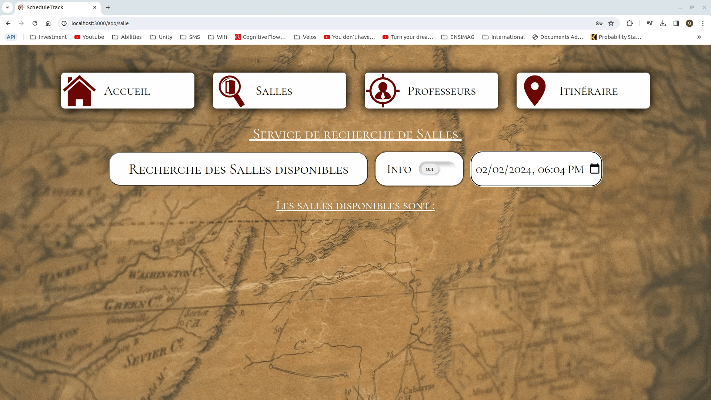
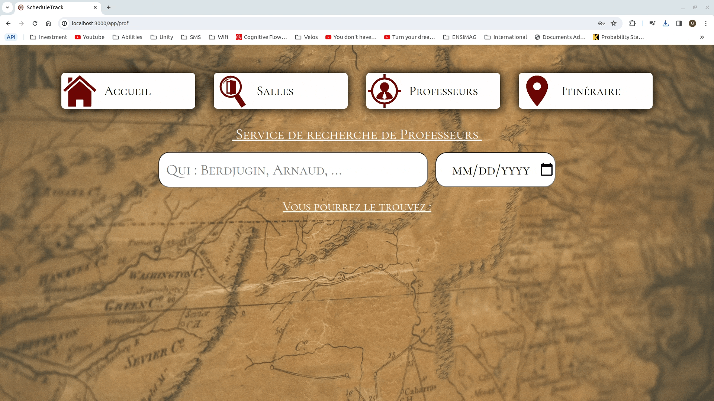

[](README.fr.md) 

# ScheduleTrack Nantes

[](https://nodejs.org/en/)
[](https://www.npmjs.com/)

ScheduleTrack Nantes is our end of term project we worked on in a group 4 in a second year of BUT in Computer Science. For this project, we had to develop a RESTful API (using multiple microservices), a web application and a mobile aplication. We decided to make this project about schedules by offering multiple services for students, in particular:
- Schedules display
- Find empty rooms
- Find a teacher's availability
- Route and departure time calculation synchronized with the schedule to get to class


## API

[](https://www.javascript.com/)

![Static Badge](https://img.shields.io/badge/Hapi-777781?style=flat&logo=data%3Aimage%2Fsvg%2Bxml%3Bbase64%2CPD94bWwgdmVyc2lvbj0iMS4wIiBlbmNvZGluZz0iVVRGLTgiPz4KPCFET0NUWVBFIHN2ZyBQVUJMSUMgIi0vL1czQy8vRFREIFNWRyAxLjEvL0VOIiAiaHR0cDovL3d3dy53My5vcmcvR3JhcGhpY3MvU1ZHLzEuMS9EVEQvc3ZnMTEuZHRkIj4KPHN2ZyB4bWxucz0iaHR0cDovL3d3dy53My5vcmcvMjAwMC9zdmciIHZlcnNpb249IjEuMSIgd2lkdGg9IjI4MHB4IiBoZWlnaHQ9IjI4MHB4IiBzdHlsZT0ic2hhcGUtcmVuZGVyaW5nOmdlb21ldHJpY1ByZWNpc2lvbjsgdGV4dC1yZW5kZXJpbmc6Z2VvbWV0cmljUHJlY2lzaW9uOyBpbWFnZS1yZW5kZXJpbmc6b3B0aW1pemVRdWFsaXR5OyBmaWxsLXJ1bGU6ZXZlbm9kZDsgY2xpcC1ydWxlOmV2ZW5vZGQiIHhtbG5zOnhsaW5rPSJodHRwOi8vd3d3LnczLm9yZy8xOTk5L3hsaW5rIj4KPGc%2BPHBhdGggc3R5bGU9Im9wYWNpdHk6MC45NjciIGZpbGw9IiM5Yjk5YTUiIGQ9Ik0gNzIuNSwyNy41IEMgNjYuMDczNSwyMi45MjcxIDY0LjQwNjgsMjQuMjYwNCA2Ny41LDMxLjVDIDU1Ljg0MzUsMzIuOTk4MiA1MC4wMTAyLDI3Ljk5ODIgNTAsMTYuNUMgNTIuNzAyNCw3LjczMDAyIDU4LjUzNTcsNC41NjMzNSA2Ny41LDdDIDcyLjY3MTQsOS4zNDI2OCA3NS4wMDQ4LDEzLjM0MjcgNzQuNSwxOUMgNzQuNjM3NywyMi4xMDQzIDczLjk3MTEsMjQuOTM3NiA3Mi41LDI3LjUgWiIvPjwvZz4KPGc%2BPHBhdGggc3R5bGU9Im9wYWNpdHk6MC45OTEiIGZpbGw9IiNmNjk5MjYiIGQ9Ik0gNzIuNSwyNy41IEMgODIuODcxOCwzOC41NzM2IDkyLjUzODUsNTAuMjQwMyAxMDEuNSw2Mi41QyA5Ny4yNTQ5LDY0LjA5NTUgOTMuMjU0OSw2Ni4wOTU1IDg5LjUsNjguNUMgODEuOTE0OCw1Ni4zMzE5IDc0LjU4MTUsNDMuOTk4NSA2Ny41LDMxLjVDIDY0LjQwNjgsMjQuMjYwNCA2Ni4wNzM1LDIyLjkyNzEgNzIuNSwyNy41IFoiLz48L2c%2BCjxnPjxwYXRoIHN0eWxlPSJvcGFjaXR5OjAuOTciIGZpbGw9IiM5Yjk4YTUiIGQ9Ik0gMTI5LjUsNjUuNSBDIDExMS4xOTksNzEuNDg3OSA5NC41MzI3LDgwLjQ4NzkgNzkuNSw5Mi41QyA3OS4wMTUyLDgyLjgxNDggODIuMzQ4NSw3NC44MTQ4IDg5LjUsNjguNUMgOTMuMjU0OSw2Ni4wOTU1IDk3LjI1NDksNjQuMDk1NSAxMDEuNSw2Mi41QyAxMDkuOCw2MC4wOTk5IDExOC4xMzMsNjAuMjY2NiAxMjYuNSw2M0MgMTI3LjU3MSw2My44NTE4IDEyOC41NzEsNjQuNjg1MSAxMjkuNSw2NS41IFoiLz48L2c%2BCjxnPjxwYXRoIHN0eWxlPSJvcGFjaXR5OjAuOTg5IiBmaWxsPSIjNzc3NzgwIiBkPSJNIDIyNi41LDEwNS41IEMgMjMzLjUwMywxMTkuODY2IDIzOC4xNywxMzQuODY2IDI0MC41LDE1MC41QyAyNDEuMjg5LDE2MS4wOCAyNDAuMTIzLDE3MS40MTMgMjM3LDE4MS41QyAyMzQuNzksMTg2Ljk0NCAyMzAuNzksMTkwLjI3NyAyMjUsMTkxLjVDIDIyMC44MjksMTkwLjQwMSAyMTguMTYyLDE4Ny43MzQgMjE3LDE4My41QyAyMTUuOTM3LDE3MS44NDQgMjE0LjkzNywxNjAuMTc3IDIxNCwxNDguNUMgMjEyLjk3MiwxMzEuMjA2IDIwNC4xMzksMTIwLjcwNiAxODcuNSwxMTdDIDE3NS42MjYsMTE1LjczNiAxNjMuOTU5LDExNi43MzYgMTUyLjUsMTIwQyAxMzUuNDY5LDEyNi4wMTIgMTE5LjgwMiwxMzQuMzQ2IDEwNS41LDE0NUMgOTAuNDc5MiwxNTcuOTYgODcuMzEyNSwxNzMuNDYgOTYsMTkxLjVDIDEwMy40NDIsMjA3LjI3NCAxMTQuNDQyLDIxOS45NDEgMTI5LDIyOS41QyAxMzIuNjQsMjM1LjA2OSAxMzEuODA3LDIzOS45MDMgMTI2LjUsMjQ0QyAxMTIuNTk3LDI0Ny43MDUgOTkuMjYzNywyNDYuMjA1IDg2LjUsMjM5LjVDIDkxLjA1NjQsMjM1LjE2OSA5Mi41NTY0LDIyOS44MzYgOTEsMjIzLjVDIDg1LjA0MTgsMjA2Ljg4MSA3NC4yMDg0LDE5NC43MTUgNTguNSwxODdDIDU1LjUsMTg2LjMzMyA1Mi41LDE4Ni4zMzMgNDkuNSwxODdDIDQ3LjYyOTgsMTg5LjA0IDQ1LjYyOTgsMTkwLjg3MyA0My41LDE5Mi41QyAzMy44MjE4LDE1MS4xNDEgNDUuODIxOCwxMTcuODA4IDc5LjUsOTIuNUMgOTQuNTMyNyw4MC40ODc5IDExMS4xOTksNzEuNDg3OSAxMjkuNSw2NS41QyAxNzEuNDgxLDU2LjI1MjggMjAzLjgxNCw2OS41ODYxIDIyNi41LDEwNS41IFoiLz48L2c%2BCjxnPjxwYXRoIHN0eWxlPSJvcGFjaXR5OjAuOTYyIiBmaWxsPSIjOWQ5YWE2IiBkPSJNIDI3OS41LDEwMy41IEMgMjc5LjUsMTA1LjUgMjc5LjUsMTA3LjUgMjc5LjUsMTA5LjVDIDI3NS42MTIsMTE3LjU4IDI2OS42MTIsMTE5LjU4IDI2MS41LDExNS41QyAyNjYuNjgyLDEwOC4zMjggMjY1LjAxNSwxMDUuNjYxIDI1Ni41LDEwNy41QyAyNTYuODEsOTcuNjg4OCAyNjEuODEsOTMuNTIyMiAyNzEuNSw5NUMgMjc1LjQyMSw5Ni42OTEzIDI3OC4wODcsOTkuNTI0NiAyNzkuNSwxMDMuNSBaIi8%2BPC9nPgo8Zz48cGF0aCBzdHlsZT0ib3BhY2l0eTowLjk3NCIgZmlsbD0iIzliOTlhNSIgZD0iTSAyMjYuNSwxMDUuNSBDIDIyOS4yMTYsMTA1LjY3OCAyMzEuODgzLDEwNi4xNzggMjM0LjUsMTA3QyAyMzcuNzQsMTA5LjA5MSAyNDEuMDc0LDExMC45MjQgMjQ0LjUsMTEyLjVDIDI0Ni40MDEsMTE1Ljk3NiAyNDguMDY4LDExOS42NDIgMjQ5LjUsMTIzLjVDIDI1MS4zMjQsMTM0LjE3IDI0OC4zMjQsMTQzLjE3IDI0MC41LDE1MC41QyAyMzguMTcsMTM0Ljg2NiAyMzMuNTAzLDExOS44NjYgMjI2LjUsMTA1LjUgWiIvPjwvZz4KPGc%2BPHBhdGggc3R5bGU9Im9wYWNpdHk6MC45ODIiIGZpbGw9IiNmNTk3MjkiIGQ9Ik0gMjYxLjUsMTE1LjUgQyAyNTcuODUyLDExOC42NiAyNTMuODUyLDEyMS4zMjcgMjQ5LjUsMTIzLjVDIDI0OC4wNjgsMTE5LjY0MiAyNDYuNDAxLDExNS45NzYgMjQ0LjUsMTEyLjVDIDI0OC42NjcsMTExLjIyMiAyNTIuNjY3LDEwOS41NTYgMjU2LjUsMTA3LjVDIDI2NS4wMTUsMTA1LjY2MSAyNjYuNjgyLDEwOC4zMjggMjYxLjUsMTE1LjUgWiIvPjwvZz4KPGc%2BPHBhdGggc3R5bGU9Im9wYWNpdHk6MC45OTEiIGZpbGw9IiM5Yjk4YTUiIGQ9Ik0gODYuNSwyMzkuNSBDIDczLjUzODIsMjUyLjA5OSA1OS44NzE1LDI1Mi43NjYgNDUuNSwyNDEuNUMgNTEuMzA0LDIzNS43MTEgNTAuMzA0LDIzMS4zNzggNDIuNSwyMjguNUMgNDAuNDg5MywyMjkuNTE5IDM4LjQ4OTMsMjMwLjUxOSAzNi41LDIzMS41QyAzMS43NDY0LDIxNy4yNjUgMzQuMDc5OCwyMDQuMjY1IDQzLjUsMTkyLjVDIDQ1LjYyOTgsMTkwLjg3MyA0Ny42Mjk4LDE4OS4wNCA0OS41LDE4N0MgNTIuNSwxODYuMzMzIDU1LjUsMTg2LjMzMyA1OC41LDE4N0MgNzQuMjA4NCwxOTQuNzE1IDg1LjA0MTgsMjA2Ljg4MSA5MSwyMjMuNUMgOTIuNTU2NCwyMjkuODM2IDkxLjA1NjQsMjM1LjE2OSA4Ni41LDIzOS41IFoiLz48L2c%2BCjxnPjxwYXRoIHN0eWxlPSJvcGFjaXR5OjAuOTY4IiBmaWxsPSIjZjU5ODI5IiBkPSJNIDQ1LjUsMjQxLjUgQyA0MC45OTk0LDI0My45MTYgMzYuNjY2MSwyNDYuNTgzIDMyLjUsMjQ5LjVDIDMwLjUyOTMsMjQ3LjE5MiAyOC41MjkzLDI0NC44NTggMjYuNSwyNDIuNUMgMjkuODMzMywyMzguODMzIDMzLjE2NjcsMjM1LjE2NyAzNi41LDIzMS41QyAzOC40ODkzLDIzMC41MTkgNDAuNDg5MywyMjkuNTE5IDQyLjUsMjI4LjVDIDUwLjMwNCwyMzEuMzc4IDUxLjMwNCwyMzUuNzExIDQ1LjUsMjQxLjUgWiIvPjwvZz4KPGc%2BPHBhdGggc3R5bGU9Im9wYWNpdHk6MC45NzciIGZpbGw9IiM5Yjk5YTYiIGQ9Ik0gMjYuNSwyNDIuNSBDIDI4LjUyOTMsMjQ0Ljg1OCAzMC41MjkzLDI0Ny4xOTIgMzIuNSwyNDkuNUMgMzMuOTU4OCwyNjUuODczIDI2LjYyNTQsMjczLjM3MyAxMC41LDI3MkMgMy44NzAzMiwyNjguNzQzIDAuNTM2OTg2LDI2My40MSAwLjUsMjU2QyAxLjUxMDgyLDI0NC45ODcgNy41MTA4MiwyMzkuNjUzIDE4LjUsMjQwQyAyMS4xNTQsMjQwLjk0MSAyMy44MjA2LDI0MS43NzQgMjYuNSwyNDIuNSBaIi8%2BPC9nPgo8L3N2Zz4K&labelColor=grey&link=https%3A%2F%2Fhapi.dev%2F)


The API is the core of this project as the web and mobile applications are simply a visual reprensetation of the data sent by the API

The API was developed in JavaScript using the following libraries

- [Hapi](https://hapi.dev/) for the API
- [Prisma](https://www.prisma.io/) for the ORM (Object-Relational Mapping) 
- [Swagger](https://swagger.io/) for the documentation
- [Chai](https://www.chaijs.com/) for the tests

and [SQLite](https://www.sqlite.org/) for the database.

The API links multiple microservices together:
- Schedules from the IUT of Nantes (by CELCAT)
- Maps and Directions API from Google

The documentation for the API endpoints is available [here](API/Documentation.pdf) or [here](API/Detailed_Documentation.pdf) (for a more detailed version)

Each API endpoint has been completely tested (see [`test-chai.mjs`](API/test/test-chai.mjs) and the [report](/Rapport_Tests.md) of the tests)


## Web application

[](https://www.javascript.com/)
[](https://react.dev)
[](https://vitejs.dev)

The web application was developed in JavaScript with the [React](https://react.dev/) framework using [Vite](https://vitejs.dev/).


## Mobile application

[](https://kotlinlang.org/)

The mobile application was developed in Kotlin.


# Installation and setup

## API

### Prerequesite

> Node.js version 18.15+

> Npm version 9.5.0+

### Deployment

First, clone this repository.

Then in the `/API` folder, execute:
```
npm install
```

After that, modify the `server` variable in the `/API/server.mjs` with the host and port you wish to use

To start the API, execute :
```
node /API/startServer.mjs
```

## Web application

### Prerequesite

> Node.js version 18.15+

> Npm version 9.5.0+

### Deployment

First, clone this repository.

Then, in the `/Application Web` folder, execute :
```
npm install
```

After that, modifty the `host` and `port` variables in the `Application Web/vite.config.js` file and the `base` variable by concatenating the host and the port.

To start the web application, execute
```
npm run dev
```

## Mobile application

### Prerequesite

>Android Gradle Plugin Version 7.2.0

>Gradle Version 7.3.3

>SDK 32 | MIN SDK 21

>Java 1.8

### Deployment

First, clone this repository.

Next, open the `MyApplication` folder in Android Studio and compile the project to run it.


# Screenshots


*Schedule*


*Find empty room*


*Find a teacher's availability*


*Directions and departure time calculation synchronized with the schedule*


# Contact

Email: [quentin.chauvelon@gmail.com](mailto:quentin.chauvelon@gmail.com) 

LinkedIn: [Quentin Chauvelon](https://www.linkedin.com/in/quentin-chauvelon/) 